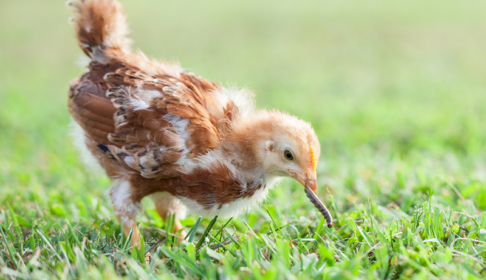

<!-- Japanese beetles -->

---
<!-- Not just a few eating my peaches -->

---
<!-- # Beetle traps -->

---
<!-- # I mean a LOT -->

---
<!-- # Ewwwww -->

---
<!-- # Pesticides -->

---
<!-- # Milky Spore -->

---
<!-- # Your neighbor's problem now -->

---
# Alternatives?

---

<!-- # Chickens!! -->

---

---
<!-- Legal issues, NYC Edition -->
§161.19  Keeping of livestock, live poultry and rabbits. (a) *No person shall keep a live rooster, duck, goose or turkey in the City of New York* except (1) in a slaughterhouse authorized by federal or state law that is subject to inspection by the New York State Department of Agriculture and Markets or the United States Department of Agriculture, or (2) as authorized by §161.01 (a) of this Article. (b) A person who is authorized by applicable law to keep for sale or sell livestock, live rabbits or poultry shall keep the premises in which such animals are held and slaughtered and the surrounding areas clean and free of animal nuisances.(c)  Live rabbit and poultry markets.Live rabbits and poultry intended for sale shall not be kept on the same premises as a multiple dwelling as defined in section 4 of the Multiple Dwelling Law, or other residence. Coops or runways of live rabbit and poultry markets shall be located at least 25 feet away from any building.

---
# A place to live

---
<!-- # The Lifecycle, 2nd grade edition -->
<!-- * live for 5-10y! -->

---
<!-- # Chicks in a box -->

---
# Brooding
brooder

* (95 - 5/week)F
* 6 weeks they have feathers are are ready

---

---
# Semi-technical talk

---
"a professional sexer can sort a thousand birds an hour with over 98% accuracy — one Hugh Grove from Oregon could hit 1500 an hour at his peak. How do you get from “it’s yellow and it doesn’t have a penis, what?” to an average of 0.5 seconds per chick?"

---
<!-- How?
- Supervised learning of chick sexing
- just like a neural network -->
- https://commoncog.com/blog/chicken-sexing-and-perceptual-learning-as-a-path-to-expertise/

---

---
<!-- - chicken feed (control what goes in)
- insects (like Japanese beetles)
- OMNIVORES -- they've eaten mice, chicks, and even killed and nibbled a small rabbit -->

---
<!-- # Predators
- fox/racoon/coyote
-->

---
<!-- hawk -->

---
<!-- 
- people, after they stop laying
- they do not taste great -->
 -->

---
<!-- # Eggs
- Start laying at ~6 months
- Color varies
- lay about an egg/day
- Stop laying around 4-6y
- break during the winter
- or molting -->

---

